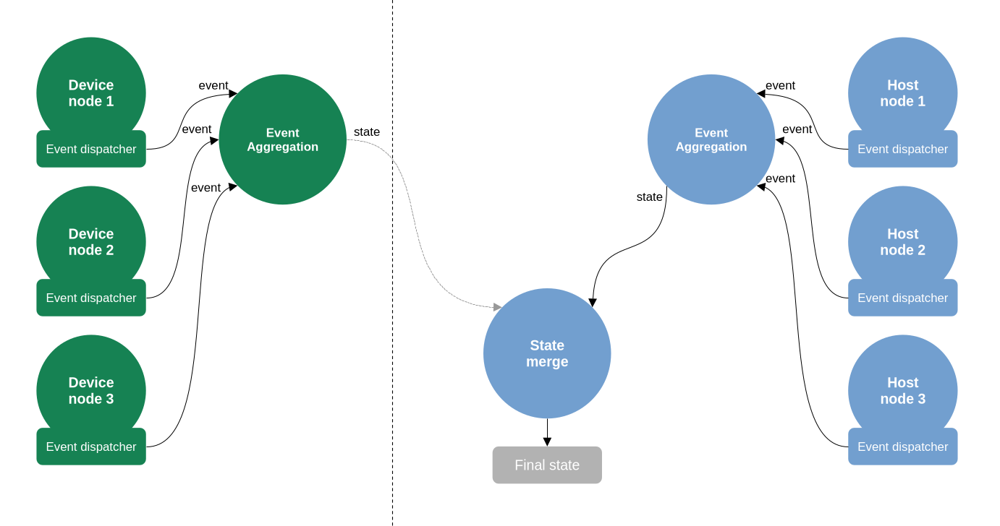

# Pipeline Debugging

## Notes

- Pipeline debugging on RVC2 is very limited compared to RVC4.
- States are calculated for individual nodes, not for node groups (e.g. instead of the `DetectionNetwork` state, `NeuralNetwork` and `DetectionParser` states are calculated).

## API

The pipeline state can be retrieved from the pipeline object by calling the `getPipelineState()` method which exposes methods for selecting which data to retrieve:

```python
pipelineState = pipeline.getPipelineState().nodes().detailed()
```

The method `nodes()` takes an optional argument to select which nodes to include in the state by their IDs. If no argument or multiple IDs are provided, the following methods can be used to select the desired data:

- `summary() -> PipelineState`: returns data pertaining the main loop and I\O blocks only. Statistics for individual inputs, outputs and other timings are not included.
- `detailed() -> PipelineState`: returns all data including statistics for individual inputs, outputs and other timings.
- `outputs() -> map(NodeId, map(str, OutputQueueState))`: returns state of all outputs per node.
- `inputs() -> map(NodeId, map(str, InputQueueState))`: returns state of all inputs per node.
- `otherTimings() -> map(NodeId, map(str, Timing))`: returns other timing statistics per node.

Specifying a single node ID to the `nodes()` method allows further filtering of the data:

- `summary() -> NodeState`: returns summary data for the specified node similarly to above.
- `detailed() -> NodeState`: returns detailed data for the specified node similarly to above.
- `outputs() -> map(str, OutputQueueState)`: returns states of all or specific outputs of the node. If only one output name is provided, the return type is `OutputQueueState`.
- `inputs() -> map(str, InputQueueState)`: returns states of all or specific inputs of the node. If only one input name is provided, the return type is `InputQueueState`.
- `otherTimings() -> map(str, Timing)`: returns other timing statistics of the node. If only one timing name is provided, the return type is `Timing`.

## Visualization

The pipeline state can be visualized using the [depthai pipeline graph tool](https://github.com/luxonis/depthai_pipeline_graph).

## Pipeline Events

### Class

```cpp
class PipelineEvent : public Buffer {
   public:
    enum class Type : std::int32_t {
        CUSTOM = 0,
        LOOP = 1,
        INPUT = 2,
        OUTPUT = 3,
        INPUT_BLOCK = 4,
        OUTPUT_BLOCK = 5,
    };
    enum class Interval : std::int32_t { NONE = 0, START = 1, END = 2 };
    enum class Status : std::int32_t {
        SUCCESS = 0,
        BLOCKED = -1,
        CANCELLED = -2,
    };

    int64_t nodeId = -1;
    Status status = 0;
    std::optional<uint32_t> queueSize;
    Interval interval = Interval::NONE;
    Type type = Type::CUSTOM;
    std::string source;
};
```

### Description

`PipelineEvent` can have different types depending on what kind of event is being reported:

- `CUSTOM` events can be defined by the node developers to report and track relevant information (e.g. timing of specific operations). These need to be manually added.
- `LOOP` events track the main processing loop timings. They can only track one loop per node. These can be generated by using the `mainLoop` method in the main `while` loop for simple nodes, or by using tracked events in more complex threaded nodes.
- `INPUT` events track input queue operations and states. These are automatically added.
- `OUTPUT` events track output queue operations and states. These are automatically added.
- `INPUT_BLOCK` events track a group of input operations. Only one input block can be tracked per node. These need to be manually added.
- `OUTPUT_BLOCK` events track a group of output operations. Only one output block can be tracked per node. These need to be manually added.

The `PipelineEvent` also contains the source node ID, the status code used to indicate success or failure of the operation (for `tryGet` and `trySend`), the queue size (if applicable - inputs only), the source or name of the event, the timestamp, the sequence number, and the interval (start, end or none). The interval is none when the end and start events are the same (e.g. simple main loop).

Pipeline events are generated using the `PipelineEventDispatcher` of a node. They can be created manually by using the `startEvent` and `endEvent` methods or by using the `BlockPipelineEvent` helper class (created using the `blockEvent` method) to automatically create start (in constructor) and end (in destructor) events for a block of code.

## Pipeline State

The pipeline state contains a map of `NodeState` objects by node ID.

### NodeState Class

```cpp
class NodeState {
   public:
    struct DurationEvent {
        PipelineEvent startEvent;
        uint64_t durationUs;
    };
    struct DurationStats {
        uint64_t minMicros = -1;
        uint64_t maxMicros = 0;
        uint64_t averageMicrosRecent = 0;
        uint64_t stdDevMicrosRecent = 0;
        uint64_t minMicrosRecent = -1;
        uint64_t maxMicrosRecent = 0;
        uint64_t medianMicrosRecent = 0;
    };
    struct Timing {
        float fps = 0.0f;
        DurationStats durationStats;
    };
    struct QueueStats {
        uint32_t maxQueued = 0;
        uint32_t minQueuedRecent = 0;
        uint32_t maxQueuedRecent = 0;
        uint32_t medianQueuedRecent = 0;
    };
    struct InputQueueState {
        enum class State : std::int32_t {
            IDLE = 0,
            WAITING = 1,
            BLOCKED = 2
        } state = State::IDLE;
        uint32_t numQueued = 0;
        Timing timing;
        QueueStats queueStats;
    };
    struct OutputQueueState {
        enum class State : std::int32_t { IDLE = 0, SENDING = 1 } state = State::IDLE;
        Timing timing;
    };
    enum class State : std::int32_t { IDLE = 0, GETTING_INPUTS = 1, PROCESSING = 2, SENDING_OUTPUTS = 3 };

    State state = State::IDLE;
    std::vector<DurationEvent> events;
    std::unordered_map<std::string, OutputQueueState> outputStates;
    std::unordered_map<std::string, InputQueueState> inputStates;
    Timing inputsGetTiming;
    Timing outputsSendTiming;
    Timing mainLoopTiming;
    std::unordered_map<std::string, Timing> otherTimings;
};
```

### NodeState Description

The `NodeState` class contains information about the state of the node, optional list of recent events (the number of events stored is limited), output and input queue states, timings for getting inputs, sending outputs, main loop timing, and other timings added by the node developer.

#### Node State

The node can be in one of the following states:

- `IDLE`: the node is not currently processing anything. This is only possible before the node has entered its main loop.
- `GETTING_INPUTS`: the node is currently trying to get inputs (in the input block).
- `PROCESSING`: the node is currently processing data (it is not in the input or the output block).
- `SENDING_OUTPUTS`: the node is currently trying to send outputs (in the output block).

#### Duration Event

The `DurationEvent` merges a start and end `PipelineEvent` by storing the start event and the calculated duration in microseconds.

#### Timing

The `Timing` struct contains the calculated frames per second and the duration statistics in microseconds:

- `minMicros`: minimum duration recorded.
- `maxMicros`: maximum duration recorded.
- `averageMicrosRecent`: average duration over recent events.
- `stdDevMicrosRecent`: standard deviation of duration over recent events.
- `minMicrosRecent`: minimum duration over recent events.
- `maxMicrosRecent`: maximum duration over recent events.
- `medianMicrosRecent`: median duration over recent events.

The timing is invalid if the minimum duration is larger than the maximum duration. This struct provides an `isValid()` method to check for validity.

#### Queue Stats

The `QueueStats` struct contains statistics about the queue sizes:

- `maxQueued`: maximum number of input messages queued.
- `minQueuedRecent`: minimum number of input messages queued over recent events.
- `maxQueuedRecent`: maximum number of input messages queued over recent events.
- `medianQueuedRecent`: median number of input messages queued over recent events.

#### Input Queue State

The `InputQueueState` struct contains the current number of queued messages, the timing information, the queue statistics and the current state of the input:

- `IDLE`: the input is waiting to get data and there are no outputs waiting to send data.
- `WAITING`: the input is waiting for a message to arrive (the input queue is empty).
- `BLOCKED`: the input queue is full and an output is attempting to send data.

#### Output Queue State

The `OutputQueueState` struct contains the timing information and the current state of the output:

- `IDLE`: the output is not currently sending data.
- `SENDING`: the output is currently sending data. If the output is blocked due to a full queue on the input the state will be `SENDING`, otherwise the send should be instantaneous and the state will return to `IDLE`.

## Operation Overview

### Schema



### Description

Each node in the pipeline has a `pipelineEventOutput` output that emits `PipelineEvent` events related to the node's operation. These events are created and sent using the `PipelineEventDispatcher` object in each node. The event output is linked to one of the `PipelineEventAggregation` nodes, depending on where the node is running (by default events do not get sent from device to host, it is however possible to subscribe to the events of a node by simply creating an output queue).

The `PipelineEventAggregation` node collects events from the nodes running on the same device and merges them into a `PipelineState` object by calculating duration statistics, events per second, and various states. The state is then sent to the `StateMerge` node which runs on host and merges device and host states into a single `PipelineState` object.

## Pipeline Event Aggregation

The `PipelineEventAggregation` node collects `PipelineEvent` events in a separate thread. To improve performance, it does not update the state for every event, but rather collects events into a buffer and processes them in batches at a fixed interval. The node can be configured to adjust the processing interval and the maximum number of stored recent events per node.

The events are processed by their type and source in pairs (start and end). Interval events (where the interval is not `NONE`) are matched by their sequence numbers. Ping events (where the interval is `NONE`) are matched by looking for the event with with the previous sequence number.

The state is filtered before sending according to the input config. By default, the node waits for a request before sending the state. If the `repeat` flag in the config is set to true, the state is sent at regular intervals.

## State Merge

The `StateMerge` node collects `PipelineState` objects from multiple `PipelineEventAggregation` nodes and merges them into a single `PipelineState` object. The merging is done by combining the node states from each device into a single map of node states - it is expected that node IDs are unique.

The node waits for the input config and forwards it to connected `PipelineEventAggregation` nodes. The returned states are matched by the config sequence number to ensure that they correspond to the same request.
