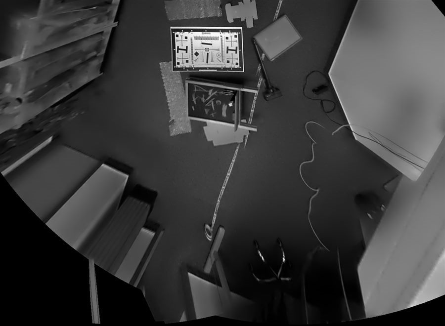
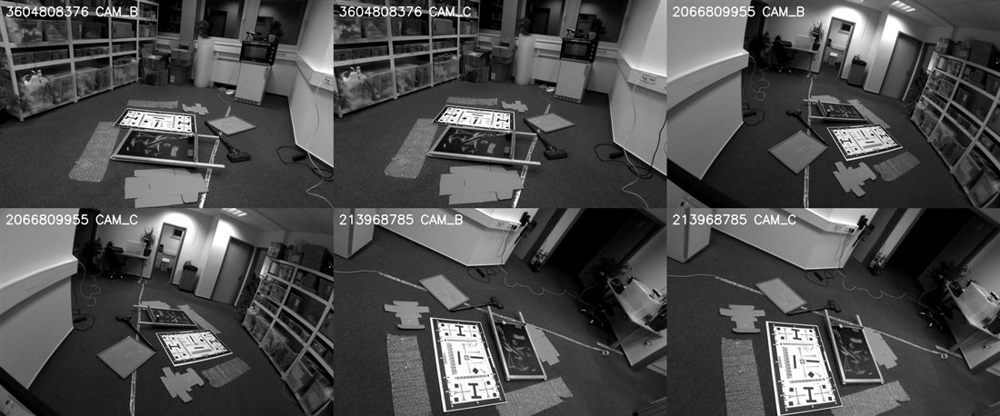
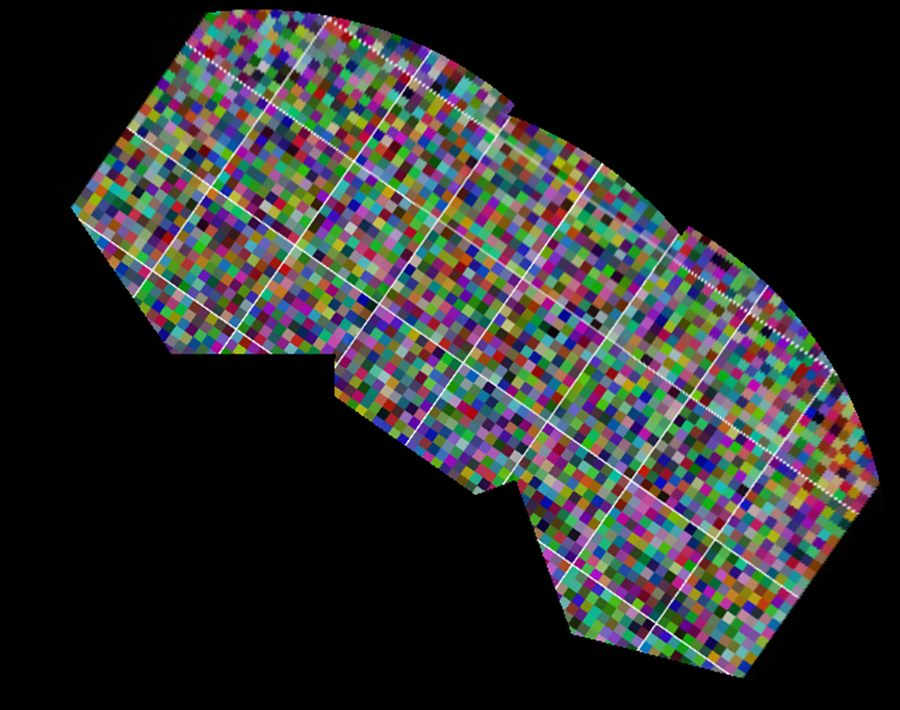

# One pipeline, many cameras: multi-device rigs and bird's-eye view in DepthAI

*Draft blog post for the multi-device features on the `poc/multi-device-stitching` branch.*

A single OAK sees a lot. Three of them, mounted around a cell, see everything — but until now they saw it as three
unrelated video streams. Getting from "three cameras" to "one picture of the floor" meant writing your own
calibration, your own coordinate bookkeeping and your own warping code.

That is what this release changes. DepthAI now knows that cameras belong to devices, that devices belong to a rig,
and that a rig can be projected into a single view:



*One image of the floor, composed from six cameras on three OAK devices. Nothing about the scene was assumed — only
the calibration of the rig.*

---

## What is new

**Coordinate frames that know their device.** `dai.CoordinateFrame(deviceId, socket)` identifies a reference frame as
one camera on one device, and every message carries the frame its extrinsics live in. `CAM_B` of one OAK is no longer
confused with `CAM_B` of another.

**A rig calibration.** `dai.MultiDeviceCalibrationHandler` holds the poses *between* devices as a small json file, and
`pipeline.setMultiDeviceCalibration()` hands it to the pipeline. Per-device calibration keeps coming from the device
itself — the rig only adds what the factory cannot know: how *you* mounted the cameras.

**A node that estimates that rig for you.** `dai.node.MultiDeviceCalibration` watches the cameras look at a shared
scene and solves for the inter-device poses, using the known stereo baselines to fix the metric scale. You provide a
rough initial guess; it provides the calibration.

**A node that unifies frames.** `dai.node.CoordinateFrameTransform` re-expresses the metadata of messages from any
device in one common frame. It never touches pixels, so it is free — and it makes any downstream node "multi-device"
without that node knowing anything about devices.

**Bird's-eye view.** The `dai.node.Stitching` node gained `Mode.PLANAR_PROJECTION`: give it a plane, get back one
calibrated image of that plane, rendered by a virtual pinhole camera.

---

## Two ways to make one image out of many

DepthAI's stitching node now has two modes, and they solve genuinely different problems.

| | `Mode.PANORAMA` | `Mode.PLANAR_PROJECTION` |
| --- | --- | --- |
| Driven by | image content (features, bundle adjustment) | calibration (extrinsics + intrinsics) |
| Needs overlap | yes | no |
| Needs calibration | no | yes |
| Models | rotation between cameras | full 3D placement, projected onto a plane |
| Good for | surveillance panoramas, distant scenes | ground planes, tables, conveyors, docking, AMR footprints |
| Per-frame cost | registration (unless fixed) + blend | remap + blend |

The panorama mode is the classic photo stitcher: it assumes the cameras sit in (roughly) the same place and only look
in different directions. Ideal for a wide view of a distant scene, hopeless for three cameras metres apart looking at
a floor.

The planar mode inverts the problem. Instead of guessing how the images relate, it asks: *for this pixel of the view
I want, which point of the plane am I looking at, and which camera saw that point?* For every output pixel it casts a
ray, intersects it with the plane, and projects the intersection back into each source camera through its full
intrinsics and distortion. Overlap becomes optional; parallax between cameras stops being an enemy, because the
geometry is known.

---

## Three cameras to a bird's-eye view

Start from the six real streams behind the picture above — three OAKs around one lab floor, `CAM_B` and `CAM_C` each:



### 1. Calibrate the rig

```bash
python3 examples/python/MultiDevice/multi_device_calibration.py \
    -d 10.12.228.177 -d 10.12.228.137 -d 10.12.228.157 \
    -g 120 -180 0 120 \
    -g -120 180 0 120 \
    -o rig_calibration.json
```

The `-g` guesses are deliberately rough — a yaw angle and a translation in centimetres, measured with a tape or read
off the CAD. The node refines them from the images and writes a rig json.

### 2. Bring everything into one frame

```python
reference = dai.CoordinateFrame(devices[0].getDeviceId(), dai.CameraBoardSocket.CAM_B)

with dai.Pipeline(createImplicitDevice=False) as pipeline:
    pipeline.setMultiDeviceCalibration(dai.MultiDeviceCalibrationHandler(Path("rig_calibration.json")))

    outputs = []
    for device in devices:
        camera = pipeline.create(dai.node.Camera, device).build(dai.CameraBoardSocket.CAM_B)
        outputs.append(camera.requestOutput((1280, 800), fps=10))

    unified = pipeline.create(dai.node.CoordinateFrameTransform).build(outputs, reference)
```

### 3. Project onto the floor

```python
    stitching = pipeline.create(dai.node.Stitching).build([unified.outputs[f"output{i}"] for i in range(len(outputs))])
    stitching.setMode(dai.node.Stitching.Mode.PLANAR_PROJECTION)
    stitching.setPlane(dai.Point3f(0, 250, 0), dai.Point3f(0, -1, 0))  # floor, 2.5 m below the reference camera
```

That is the whole configuration: a point on the plane and its normal, in the reference camera's frame. No view was
specified, so the node computes one — it intersects each camera's field of view with the plane, frames all the
footprints and picks a resolution matching the input sampling. When you do want a specific viewpoint:

```python
    stitching.setView(dai.node.Stitching.VirtualCamera.lookAt(
        position=dai.Point3f(0, -50, 200), target=dai.Point3f(0, 250, 200), up=dai.Point3f(0, 0, 1),
        hFovDegrees=100.0, width=1400, height=1400))
```

The output is an ordinary `ImgFrame` carrying an `ImgTransformation` — the virtual pinhole camera, expressed in the
rig's reference frame. Run a detector on the bird's-eye view and you can map the boxes straight back onto the floor
in centimetres.

---

## The plane does not have to be the floor

Nothing in the implementation is specific to "down". The plane is an arbitrary point and normal in the reference
frame, so the same node renders:

* the **floor** under an AMR or a robotic cell — the classic bird's-eye view,
* a **wall or a shelf front**, flattened from cameras looking at it from three angles,
* a **conveyor belt** at whatever angle it happens to run,
* a **table or work surface**, viewed straight down even though no camera is above it.

Two guards keep the result honest: `setMaxRange()` stops painting the plane beyond a distance you trust, and
`setMinIncidenceAngle()` drops rays that graze the plane so shallowly that a handful of pixels would be smeared over
metres. Objects standing *off* the plane are, of course, still projected onto it — a box on the floor leans outward
from every camera that sees it, exactly like it does in any inverse-perspective mapping.

---

## What it costs

The geometry is fixed after the first synced group: the remap tables, the seam masks and the exposure gains are
computed once. From there, a frame is a `cv::remap` per input plus a multi-band blend — no feature detection, no
matching, no bundle adjustment. It is cheaper per frame than the panorama mode, and it does not drift when the scene
is texture-poor, because it never looked at the texture in the first place.

---

## Try it without hardware

The synthetic example renders a known ground texture from virtual cameras and stitches it back — a self-contained
check that the geometry is right, no devices required:

```bash
python3 examples/python/MultiDevice/planar_stitching_synthetic.py
python3 examples/python/MultiDevice/planar_stitching_synthetic.py --top-down
```



*Three virtual cameras looking at a textured ground plane. The grid lines stay straight and continuous across the
seams — the projection, not the image content, put them there.*

Then read [`examples/python/MultiDevice/README.md`](../../examples/python/MultiDevice/README.md) for the full API,
the rig json format and the tuning knobs.
