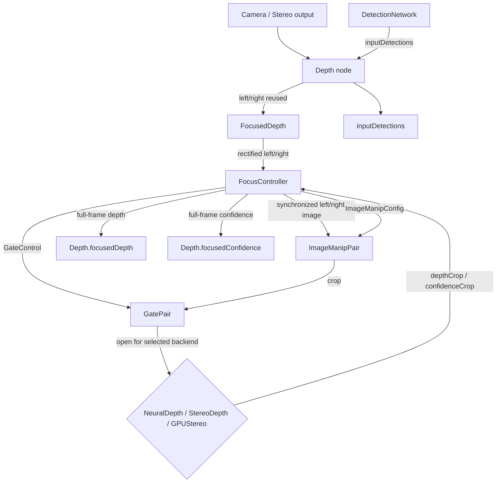

> **Status:** Living document · **Layer:** Design spec / PRD (PoC)
> **Component:** `dai::node::FocusedDepth` (`include/depthai/pipeline/node/FocusedDepth.hpp`, `src/pipeline/node/FocusedDepth.cpp`)
> **Host controller:** `dai::node::FocusController` (`include/depthai/pipeline/node/host/FocusController.hpp`, `src/pipeline/node/FocusController.cpp`)
> **User-facing surface:** `dai::node::Depth::inputDetections`, `Depth::focusedDepth()`, `Depth::focusedConfidence()`

## About this document

This is the design specification for the **focused depth** feature. It describes the `FocusedDepth` sub-graph and the `FocusController` that drives it. The `FocusedDepth` node is an internal `DeviceNodeGroup` owned by the existing `Depth` node; the user-facing API is exposed through `Depth`. This spec captures the intent, interface, data flow, and behavior for the PoC implementation.

---

## 1. Overview

### 1.1 Purpose

`FocusedDepth` is a `DeviceNodeGroup` that computes a full-frame depth map in which only the regions indicated by `ImgDetections` are filled. It reuses the same left/right stereo streams as the parent `Depth` node, extracts per-detection crops, routes the crops to one of three candidate backends (`NeuralDepth`, `StereoDepth`, or `GPUStereo`), and reassembles the per-crop results into a single full-resolution output. The rest of the output is zero.

### 1.2 What it solves

- **Per-detection high-resolution depth.** The user supplies object detections and gets a depth map focused on those objects, while the original `Depth` node's `depth()`/`confidence()` outputs continue unchanged.
- **Backend flexibility per frame.** It selects the fastest backend for the current set of crops based on the total crop area and the configured frame budget.
- **Coordinate-system independence.** Detections may be in a different camera frame; the `ImgDetections` transformation is used to remap them to the left rectified frame.
- **No new public left/right inputs.** It does not expose `left`/`right` as public inputs; it taps the same stereo camera outputs already used by the parent `Depth` node.

### 1.3 Non-goals

- It does not replace the main `Depth` flow; `Depth::depth()` and `Depth::confidence()` remain unchanged.
- It does not produce a per-crop stream of depth maps; it produces a single full-frame depth map.
- It does not process crops in parallel; processing is sequential per frame.
- It does not support per-crop selection of different backends within one frame; a single backend is chosen for the whole frame.
- It does not handle segmentation masks; `ImgDetections` segmentation mask is ignored.

### 1.4 Execution location

- **Runs on:** Device, with a host-side controller (`FocusController`) that orchestrates the per-frame crop flow.
- The `FocusController` is a `CustomNode` / `HostNode` that runs on the host, synchronizes `left`, `right`, and `inputDetections`, and drives `ImageManip` crops and `Gate` controls.
- The heavy processing (rectification, cropping, and backend depth) runs on the device.
- OpenCV support is required on the host for `FocusController` reassembly.

---

## 2. Use cases

1. **Object-centric depth.** A `DetectionNetwork` produces `ImgDetections` from the color camera. The user links `detectionNetwork.out` to `depth.inputDetections` and reads `depth.focusedDepth` to get depth only for the detected objects, remapped to the left stereo frame.
2. **Region-of-interest depth.** A host application or `Script` node publishes `ImgDetections` describing arbitrary ROIs and consumes the focused depth output.
3. **Higher-quality depth for small regions.** When the total crop area fits the frame budget, the node uses `NeuralDepth` for better per-region depth while the main `Depth` node uses a different backend for the full frame.

---

## 3. Interface

`FocusedDepth` is intended to be created and wired by `Depth`. The user-facing surface is on `Depth`.

### 3.1 Inputs

| Name | Node | API | Type | Meaning |
|---|---|---|---|---|
| `inputDetections` | `Depth` | `Depth::inputDetections` | `Input&` | `ImgDetections` carrying normalized bounding boxes and an optional `ImgTransformation`. Each detection defines an ROI for focused depth. |
| `left` | `FocusedDepth` (internal) | `FocusedDepth::build(left, right, ...)` | `Node::Output&` | Left camera/frame output, sourced from the parent `Depth` node's stereo wiring. Not a public user input. |
| `right` | `FocusedDepth` (internal) | `FocusedDepth::build(left, right, ...)` | `Node::Output&` | Right camera/frame output, sourced from the parent `Depth` node's stereo wiring. Not a public user input. |

### 3.2 Outputs

| Name | Node | API | Type | Meaning |
|---|---|---|---|---|
| `focusedDepth` | `Depth` | `Depth::focusedDepth()` | `Node::Output&` | Full-frame `RAW16` depth map. Focused regions are filled; all other pixels are `0`. |
| `focusedConfidence` | `Depth` | `Depth::focusedConfidence()` | `Node::Output&` | Full-frame `RAW8` confidence map. Same spatial layout as `focusedDepth`. |
| `depth` | `FocusedDepth` | `FocusedDepth::depth` | `Output&` | Internal output of the focused depth graph. Linked to `Depth::focusedDepth`. |
| `confidence` | `FocusedDepth` | `FocusedDepth::confidence` | `Output&` | Internal output of the focused confidence graph. Linked to `Depth::focusedConfidence`. |

### 3.3 Settings / arguments (pre-wiring)

| API | Effect |
|---|---|
| `FocusedDepth::build(left, right, fps, resolution)` | Wires the sub-graph. `fps` is the target frame budget passed to `FocusController`. `resolution` optionally sets `Rectification` output size. |
| `FocusController::setTargetFps(float)` | Sets the target FPS used for backend selection. |
| `FocusController::setNeuralModel(DeviceModelZoo)` | Sets the `NeuralDepth` model to use. |
| `FocusController::setStereoSize(int, int)` | Sets the fixed input size for `StereoDepth` (default `640x400`). |
| `FocusController::setStereoFps(float)` | Sets the assumed `StereoDepth` FPS. |

### 3.4 Introspection getters

`FocusedDepth` / `FocusController` currently expose no introspection getters. The resolved backend is not exposed in the PoC.

### 3.5 Public API surface

**C++** (`include/depthai/pipeline/node/Depth.hpp`):
```cpp
Input& inputDetections;
Node::Output& focusedDepth();
Node::Output& focusedConfidence();
```

**Python** (`bindings/python/src/pipeline/node/DepthBindings.cpp`):
```python
depth.inputDetections
depth.focusedDepth
depth.focusedConfidence
```

**Python example** (`examples/python/Depth/focused_depth.py`):
```python
depth = pipeline.create(dai.node.Depth)
detectionNetwork.out.link(depth.inputDetections)
focusedDepthQueue = depth.focusedDepth.createOutputQueue(...)
```

---

## 4. Decision logic

### 4.1 Backend selection

For each incoming synchronized group, `FocusController`:

1. Computes the `maxD` disparity extension.
2. Computes a list of clamped, extended crops.
3. Computes the total crop area and the largest crop dimensions.
4. Estimates the sequential processing time for the three candidate backends:
   - **NeuralDepth:** `neuralTime = max(N, totalArea / neuralArea) / neuralFps`
   - **StereoDepth:** `stereoTime = max(N, totalArea / stereoArea) / stereoFps`
   - **GPUStereo:** `gpuTime = max(N, totalArea / gpuArea) / gpuFps` (only if the largest crop fits the chosen profile)
5. Selects the backend with the smallest estimated time.

### 4.2 Crop computation

For each detection, `FocusController` uses the outer bounding box returned by `ImgDetection::getOuterBoundingBox()` and converts the normalized `[minx, miny, maxx, maxy]` to pixel coordinates on the left rectified frame.

The crop is extended horizontally to account for the maximum disparity:

```text
maxD = round(192 * frameWidth / 1280)
cropX = detX - maxD
cropW = detW + 2 * maxD
cropY = detY
cropH = detH
```

The crop is clamped to the frame bounds. The detection region inside the crop (before resize) is at `x = detX - cropX`..`detX - cropX + detW`, which is `maxD`..`maxD + detW` when no clamping occurs.

### 4.3 Data flow



The crop `ImageManip` pair is fed by `FocusController`'s `leftImage`/`rightImage` outputs (the exact synchronized left/right pair the controller selected for the current group), **not** by the free-running rectification stream. This guarantees both crops share a timestamp so the backend's internal left/right `Sync` can pair them; feeding the crops directly from rectification lets the two manips latch different frames and the backend never emits a crop.

---

## 5. Happy paths

| # | Scenario | Code / Graph | Outcome |
|---|---|---|---|
| H1 | Detections in the same frame as the left camera | `detectionNetwork.out` linked to `depth.inputDetections`, no `transformation` set on detections | `FocusController` uses `dets->detections` as-is and computes focused crops in the left frame. |
| H2 | Detections in a different camera frame | `ImgDetections` carry `transformation` from the source camera | `FocusController` calls `dets->transformTo(leftImg->getTransformation())` to remap detections to the left rectified frame. |
| H3 | Small total crop area (fits NeuralDepth budget) | Total crop area fits within the `NeuralDepth` model's frame budget at `targetFps` | `FocusController` selects `NeuralDepth`, routes crops through `neuralDepth`, and reassembles. |
| H4 | Large total crop area | Total crop area exceeds `NeuralDepth` budget, fits `StereoDepth`/`GPUStereo` | `FocusController` selects `StereoDepth` or `GPUStereo` and resizes each crop to the fixed backend input size. |
| H5 | No detections or empty list | `inputDetections` sends zero detections | `FocusController` outputs a zero `RAW16` depth map and a zero `RAW8` confidence map with the same frame metadata as `left`. |

---

## 6. Unhappy paths

| # | Scenario | Result |
|---|---|---|
| U1 | `ImgDetections` transformation missing and detections are in a different coordinate system | `FocusController` falls back to using the raw `detections` vector; if the coordinate system is wrong, the crop regions will be misaligned. |
| U2 | `transformTo` throws | `FocusController` catches the exception and falls back to the raw `detections` vector. |
| U3 | A crop is fully outside the frame bounds | The crop is skipped after clamping. |
| U4 | Backend depth/confidence crop not produced within the 5-second timeout | `FocusController` skips that crop and continues with the next one. |
| U5 | `left` or `right` frame missing from the `MessageGroup` | `FocusController` returns `nullptr` and emits nothing for that frame. |
| U6 | `inputDetections` not connected | `Sync` is configured with `inputDetections.setWaitForMessage(false)`, so the `MessageGroup` still fires and produces an empty (zero) focused output. |

---

## 7. Behavior reference: backend resolution

| Crop characteristics | Selected backend | Notes |
|---|---|---|
| `NeuralDepth` has the lowest estimated time for the frame | `NeuralDepth` | Default on RVC4 when the selected `DeviceModelZoo` is `NEURAL_DEPTH_480X300` (or overridden by `setNeuralModel`). Crops are resized to the model input size. |
| `StereoDepth` has the lowest estimated time | `StereoDepth` | Crops are resized to the fixed `StereoDepth` input size (default `640x400`, overridable by `setStereoSize`). |
| `GPUStereo` has the lowest estimated time and the largest crop fits the chosen `GPUStereo` profile | `GPUStereo` | Profiles: `640x400 @ 55 fps`, `1280x800 @ 30 fps`, `2592x1944 @ 5 fps`. |

---

## 8. Error handling

### 8.1 Principles

- Degrade gracefully when `ImgDetections` are missing or malformed; emit a zero output rather than crashing.
- `FocusController` runs on the host and uses `try/catch` around `ImgDetections::transformTo` and `ImgDetection::getOuterBoundingBox`.
- Per-crop backend timeouts are treated as skipped crops, not fatal errors.

### 8.2 Error catalog

| Trigger | Message / behavior | Source |
|---|---|---|
| `transformTo` fails | `catch(...)` and fall back to raw `dets->detections` | `FocusController::processGroup` |
| `getOuterBoundingBox` throws | Detection is skipped | `FocusController::processGroup` |
| `depthCrop` or `confidenceCrop` not received within 5 s | Crop is skipped, `continue` | `FocusController::processGroup` |
| `depthCropMat` or `confCropMat` is empty | Crop is skipped, `continue` | `FocusController::processGroup` |
| `Depth::focusedDepth()` called before backend output is wired | `DAI_CHECK_V` with "Depth focused backend output missing." | `Depth::focusedDepth` |
| `Depth::focusedConfidence()` called before backend output is wired | `DAI_CHECK_V` with "Depth focused backend confidence output missing." | `Depth::focusedConfidence` |

### 8.3 Observability

- The backend selection is not logged in the PoC. A `TODO` comment notes that `framePeriod` is reserved for future logging.
- The `Depth` node logs the resolved algorithm/config for the main flow, not the focused flow.

---

## 9. Open questions / known asymmetries

- `StereoDepth` and `GPUStereo` input sizes are fixed in `FocusController` (default `640x400` for stereo). This is independent of the actual crop size and may result in unnecessary downscaling or upscaling.
- `NeuralDepth` FPS values are hard-coded per `DeviceModelZoo` in `FocusController::setNeuralModel`; they should be derived from `BackendProfile` or measured benchmarks.
- Crops are processed sequentially. Parallel crop processing could improve throughput but is not implemented.
- The confidence map is not combined or weighted; it is simply copied from the crop into the full-frame output.
- `FocusController` uses `cv::Mat` and `ImgFrame::getFrame`/`setFrame` on the host; this requires OpenCV support and ties the focused-depth output to the host pipeline path.
- The `GPUStereo` profile constants are hard-coded in `FocusController`. They should be centralized or exposed by `GPUStereo`.
- `FocusedDepth` is not bound to Python and is not directly constructible by users; it is accessible only through `Depth`. A future version may expose it as a standalone node.
