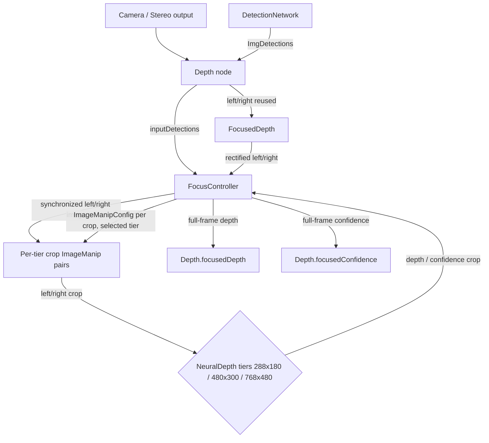

> **Status:** Living document · **Layer:** Design spec / PRD (PoC)
> **Component:** `dai::node::FocusedDepth` (`include/depthai/pipeline/node/FocusedDepth.hpp`, `src/pipeline/node/FocusedDepth.cpp`)
> **Host controller:** `dai::node::FocusController` (`include/depthai/pipeline/node/host/FocusController.hpp`, `src/pipeline/node/FocusController.cpp`)
> **User-facing surface:** `dai::node::Depth::inputDetections`, `Depth::focusedDepth()`, `Depth::focusedConfidence()`

## About this document

This is the design specification for the **focused depth** feature. It describes the `FocusedDepth` sub-graph and the `FocusController` that drives it. The `FocusedDepth` node is an internal `DeviceNodeGroup` owned by the existing `Depth` node; the user-facing API is exposed through `Depth`. This spec captures the intent, interface, data flow, and behavior for the PoC implementation.

---

## 1. Overview

### 1.1 Purpose

`FocusedDepth` is a `DeviceNodeGroup` that computes a full-frame depth map in which only the regions indicated by `ImgDetections` are filled. It reuses the same left/right stereo streams as the parent `Depth` node, extracts per-detection crops, merges overlapping crops, routes them to one of several fixed-size `NeuralDepth` backends selected by crop size, and reassembles the per-detection results into a single full-resolution output. The rest of the output is zero.

### 1.2 What it solves

- **Per-detection high-resolution depth.** The user supplies object detections and gets a depth map focused on those objects, while the original `Depth` node's `depth()`/`confidence()` outputs continue unchanged.
- **Throughput.** Overlapping crops are merged so a group of nearby detections costs one inference instead of one per detection, and all crop configs for a frame are dispatched up front so the crop `ImageManip`s and the `NeuralDepth` backend run pipelined rather than one host<->device round-trip per crop.
- **Backend sizing per frame.** Several fixed-size `NeuralDepth` backends are wired; the frame is routed to the smallest one whose model fits the largest crop, so small scenes use a fast small model and larger crops use a larger model.
- **Coordinate-system independence.** Detections may be in a different camera frame; the `ImgDetections` transformation is used to remap them to the left rectified frame.
- **No new public left/right inputs.** It does not expose `left`/`right` as public inputs; it taps the same stereo camera outputs already used by the parent `Depth` node.

### 1.3 Non-goals

- It does not replace the main `Depth` flow; `Depth::depth()` and `Depth::confidence()` remain unchanged.
- It does not produce a per-crop stream of depth maps; it produces a single full-frame depth map.
- It does not route different crops of the same frame to different backends; a single backend tier is chosen per frame (see §4.1) to avoid per-crop NN model reloads on the device's single NN engine.
- It does not use `StereoDepth` or `GPUStereo`; every tier is a fixed-size `NeuralDepth` backend.
- It does not handle segmentation masks; `ImgDetections` segmentation mask is ignored.

### 1.4 Execution location

- **Runs on:** Device, with a host-side controller (`FocusController`) that orchestrates the per-frame crop flow.
- The `FocusController` is a `CustomNode` / `HostNode` that runs on the host, synchronizes `left`, `right`, and `inputDetections`, and drives the per-tier crop `ImageManip`s.
- The heavy processing (rectification, cropping, and backend depth) runs on the device.
- OpenCV support is required on the host for `FocusController` reassembly.

---

## 2. Use cases

1. **Object-centric depth.** A `DetectionNetwork` produces `ImgDetections` from the color camera. The user links `detectionNetwork.out` to `depth.inputDetections` and reads `depth.focusedDepth` to get depth only for the detected objects, remapped to the left stereo frame.
2. **Region-of-interest depth.** A host application or `Script` node publishes `ImgDetections` describing arbitrary ROIs and consumes the focused depth output.
3. **Higher-quality depth for small regions.** Crops are routed to a `NeuralDepth` model sized to the crop, giving better per-region depth than a single fixed-size full-frame pass while the main `Depth` node runs independently.

---

## 3. Interface

`FocusedDepth` is intended to be created and wired by `Depth`. The user-facing surface is on `Depth`.

### 3.1 Inputs

| Name | Node | API | Type | Meaning |
|---|---|---|---|---|
| `inputDetections` | `Depth` | `Depth::inputDetections` | `Input&` | `ImgDetections` carrying normalized bounding boxes and an optional `ImgTransformation`. Each detection defines an ROI for focused depth. |
| `left` | `FocusedDepth` (internal) | `FocusedDepth::build(left, right, ...)` | `Node::Output&` | Left camera/frame output, sourced from the parent `Depth` node's stereo wiring. Not a public user input. |
| `right` | `FocusedDepth` (internal) | `FocusedDepth::build(left, right, ...)` | `Node::Output&` | Right camera/frame output, sourced from the parent `Depth` node's stereo wiring. Not a public user input. |

### 3.2 Outputs

| Name | Node | API | Type | Meaning |
|---|---|---|---|---|
| `focusedDepth` | `Depth` | `Depth::focusedDepth()` | `Node::Output&` | Full-frame `RAW16` depth map. Focused regions are filled; all other pixels are `0`. |
| `focusedConfidence` | `Depth` | `Depth::focusedConfidence()` | `Node::Output&` | Full-frame `RAW8` confidence map. Same spatial layout as `focusedDepth`. |
| `depth` | `FocusedDepth` | `FocusedDepth::depth` | `Output&` | Internal output of the focused depth graph. Linked to `Depth::focusedDepth`. |
| `confidence` | `FocusedDepth` | `FocusedDepth::confidence` | `Output&` | Internal output of the focused confidence graph. Linked to `Depth::focusedConfidence`. |

### 3.3 Settings / arguments (pre-wiring)

| API | Effect |
|---|---|
| `FocusedDepth::build(left, right, fps, resolution)` | Wires the sub-graph. `resolution` optionally sets `Rectification` output size. |

The backend tiers are fixed at compile time in `FocusController::kTiers` (`288x180`, `480x300`, `768x480` `NeuralDepth` models). There are no runtime backend-selection setters in the PoC.

### 3.4 Introspection getters

`FocusedDepth` / `FocusController` currently expose no introspection getters. The per-frame selected tier is not exposed in the PoC.

### 3.5 Public API surface

**C++** (`include/depthai/pipeline/node/Depth.hpp`):
```cpp
Input& inputDetections;
Node::Output& focusedDepth();
Node::Output& focusedConfidence();
```

**Python** (`bindings/python/src/pipeline/node/DepthBindings.cpp`):
```python
depth.inputDetections
depth.focusedDepth
depth.focusedConfidence
```

**Python example** (`examples/python/Depth/focused_depth.py`):
```python
depth = pipeline.create(dai.node.Depth)
detectionNetwork.out.link(depth.inputDetections)
focusedDepthQueue = depth.focusedDepth.createOutputQueue(...)
```

---

## 4. Decision logic

### 4.1 Backend selection

Several fixed-size `NeuralDepth` backends (tiers) are wired at build time, each with its own left/right crop `ImageManip` pair. `FocusController::kTiers` defines them, ascending in size: `288x180`, `480x300`, `768x480`. Sizes are capped at `768x480` because the largest models (e.g. `1248x780`) run at ~8.5 fps on RVC4; a crop larger than the top tier is downscaled into it (per-crop focal correction, §4.4, keeps depth metric) rather than routed to a much slower model.

For each incoming synchronized group, `FocusController`:

1. Computes the clamped, disparity-extended crops (§4.2) and merges overlapping ones (§4.3).
2. Finds the largest merged crop (max width, max height).
3. Selects a single tier for the whole frame: `selectTier(maxW, maxH)` = the smallest tier whose model width and height both fit the largest crop, or the top tier otherwise.
4. Every merged crop of that frame is processed by that one tier.

A single tier per frame is deliberate: RVC4 has one NN engine, so alternating between differently sized depth models within a frame forces an expensive model reload per crop. Routing each crop to its own best-fit tier was measured ~2.5x slower for mixed-size scenes and far worse alongside a detection network (~0.7 fps vs ~6 fps).

### 4.2 Crop computation

For each detection, `FocusController` uses the outer bounding box returned by `ImgDetection::getOuterBoundingBox()` and converts the normalized `[minx, miny, maxx, maxy]` to pixel coordinates on the left rectified frame.

The crop is extended horizontally to account for the maximum disparity:

```text
maxD = round(192 * frameWidth / 1280)
cropX = detX - maxD
cropW = detW + 2 * maxD
cropY = detY
cropH = detH
```

The crop is clamped to the frame bounds. The detection region inside the crop (before resize) is at `x = detX - cropX`..`detX - cropX + detW`, which is `maxD`..`maxD + detW` when no clamping occurs.

### 4.3 Crop merging

`FocusController::mergeCrops` reduces the per-detection crops to a set of `MergedCrop`s before dispatch. Two crops are merged when their rectangles have a positive-area intersection (exact edge-touching is treated as non-overlap); merging is transitive, so chains of overlapping crops collapse into one. Each `MergedCrop` stores the union inference rectangle **and** the list of original detection boxes it covers. The backend runs once on the union rectangle; reassembly (§4.5) then copies back each original detection box individually, so merging never enlarges the filled output region — it only reduces the number of inferences.

### 4.4 Per-crop depth correction

Each crop is `STRETCH`-resized to the selected tier's fixed model width `outW`, so the backend estimates disparity in a rescaled grid. The returned depth is corrected on the host to stay metric across crop widths:

```text
depthScale = (fxFull * outW / cropW) / fxUsed
```

where `fxFull` is the focal length of the synchronized full rectified left frame, `cropW` is the merged crop's native width, and `fxUsed` is the focal length reported by the returned backend depth frame's transformation. The correction is a no-op (`depthScale ≈ 1`) if the backend ever reports a correctly crop-scaled focal.

### 4.5 Data flow



Each tier has its own left/right crop `ImageManip` pair and its own `NeuralDepth` backend, so the left and right crops fed to any one backend always share the same fixed size (this removes the earlier left/right size-mismatch crash). All crop `ImageManip` pairs are fed by `FocusController`'s `leftImage`/`rightImage` outputs (the exact synchronized left/right pair the controller selected for the current group), **not** by the free-running rectification stream. This guarantees both crops share a timestamp so the backend's internal left/right `Sync` can pair them; feeding the crops directly from rectification lets the two manips latch different frames and the backend never emits a crop.

There are no `Gate` nodes: because each tier has dedicated `ImageManip`s and only the selected tier receives configs for a frame, crops are routed by construction rather than gated. For a frame, `FocusController` sends every crop config for the selected tier first (phase 1), then collects the tier's depth/confidence results in dispatch order (phase 2). The per-tier crop input queues hold up to `kMaxCropsPerFrame` messages so all dispatched crops can be buffered before collection.

---

## 5. Happy paths

| # | Scenario | Code / Graph | Outcome |
|---|---|---|---|
| H1 | Detections in the same frame as the left camera | `detectionNetwork.out` linked to `depth.inputDetections`, no `transformation` set on detections | `FocusController` uses `dets->detections` as-is and computes focused crops in the left frame. |
| H2 | Detections in a different camera frame | `ImgDetections` carry `transformation` from the source camera | `FocusController` calls `dets->transformTo(leftImg->getTransformation())` to remap detections to the left rectified frame. |
| H3 | Small crops | Largest crop fits the smallest tier | `FocusController` routes the frame to the `288x180` tier for the fastest inference and reassembles. |
| H4 | Larger crops | Largest crop exceeds the smaller tiers | `FocusController` routes the frame to the smallest tier that fits (or the top `768x480` tier, downscaling), resizing each crop to that model's input size. |
| H5 | No detections or empty list | `inputDetections` sends zero detections | `FocusController` outputs a zero `RAW16` depth map and a zero `RAW8` confidence map with the same frame metadata as `left`. |
| H6 | Overlapping detections | Two or more crops overlap | `mergeCrops` combines them into one union inference; each original detection box is copied back individually during reassembly. |

---

## 6. Unhappy paths

| # | Scenario | Result |
|---|---|---|
| U1 | `ImgDetections` transformation missing and detections are in a different coordinate system | `FocusController` falls back to using the raw `detections` vector; if the coordinate system is wrong, the crop regions will be misaligned. |
| U2 | `transformTo` throws | `FocusController` catches the exception and falls back to the raw `detections` vector. |
| U3 | A crop is fully outside the frame bounds | The crop is skipped after clamping. |
| U4 | Backend depth/confidence crop not produced within the 5-second timeout | `FocusController` skips that crop and continues with the next one. |
| U5 | `left` or `right` frame missing from the `MessageGroup` | `FocusController` returns `nullptr` and emits nothing for that frame. |
| U6 | `inputDetections` not connected | `Sync` is configured with `inputDetections.setWaitForMessage(false)`, so the `MessageGroup` still fires and produces an empty (zero) focused output. |

---

## 7. Behavior reference: tier resolution

The tier is selected once per frame from the largest merged crop (`selectTier(maxW, maxH)`).

| Largest merged crop | Selected tier | Notes |
|---|---|---|
| `w <= 288` and `h <= 180` | `NEURAL_DEPTH_288X180` | Fastest; used for small scenes. |
| `w <= 480` and `h <= 300` | `NEURAL_DEPTH_480X300` | |
| otherwise | `NEURAL_DEPTH_768X480` | Top tier; crops larger than this are downscaled into it. Per-crop focal correction (§4.4) keeps depth metric. |

---

## 8. Error handling

### 8.1 Principles

- Degrade gracefully when `ImgDetections` are missing or malformed; emit a zero output rather than crashing.
- `FocusController` runs on the host and uses `try/catch` around `ImgDetections::transformTo` and `ImgDetection::getOuterBoundingBox`.
- Per-crop backend timeouts are treated as skipped crops, not fatal errors.

### 8.2 Error catalog

| Trigger | Message / behavior | Source |
|---|---|---|
| `transformTo` fails | `catch(...)` and fall back to raw `dets->detections` | `FocusController::processGroup` |
| `getOuterBoundingBox` throws | Detection is skipped | `FocusController::processGroup` |
| `depthCrop` or `confidenceCrop` not received within 5 s | Crop is skipped, `continue` | `FocusController::processGroup` |
| `depthCropMat` or `confCropMat` is empty | Crop is skipped, `continue` | `FocusController::processGroup` |
| `Depth::focusedDepth()` called before backend output is wired | `DAI_CHECK_V` with "Depth focused backend output missing." | `Depth::focusedDepth` |
| `Depth::focusedConfidence()` called before backend output is wired | `DAI_CHECK_V` with "Depth focused backend confidence output missing." | `Depth::focusedConfidence` |

### 8.3 Observability

- The backend selection is not logged in the PoC. A `TODO` comment notes that `framePeriod` is reserved for future logging.
- The `Depth` node logs the resolved algorithm/config for the main flow, not the focused flow.

---

## 9. Open questions / known asymmetries

- The tier sizes (`288x180`, `480x300`, `768x480`) and the `768x480` cap are hard-coded in `FocusController::kTiers`. They were chosen from RVC4 benchmarks and are not configurable at runtime.
- All resident tier models are loaded on the device even if a tier is never selected; this costs device memory. Adding tiers trades memory for finer size routing.
- Tier selection is per frame; a frame with one tiny and one large crop uses the large tier for both, so the tiny crop is processed at higher resolution than strictly necessary (the alternative, per-crop routing, is far slower on the single NN engine).
- The confidence map is not combined or weighted; it is simply copied from the crop into the full-frame output.
- `FocusController` uses `cv::Mat` and `ImgFrame::getFrame`/`setFrame` on the host; this requires OpenCV support and ties the focused-depth output to the host pipeline path.
- Merged crop unions may be larger than any single detection crop, which can push a frame into a larger tier than any individual detection would need.
- `FocusedDepth` is not bound to Python and is not directly constructible by users; it is accessible only through `Depth`. A future version may expose it as a standalone node.
