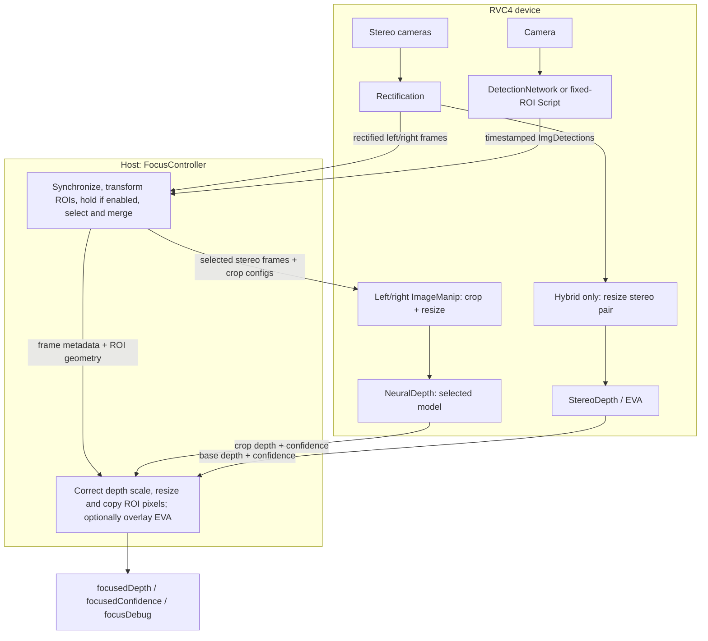

# Focused depth PoC

Focused depth runs NeuralDepth on selected regions of a stereo pair, then places
those results in a full-size depth image in **rectified-left coordinates**. It is
exposed through `Depth`; the internal `FocusedDepth` graph reuses its stereo cameras.
The Python examples require RVC4 and select one neural model per run.

## Data flow

```mermaid
flowchart TD
    subgraph Device["RVC4 device"]
        Cameras["Stereo cameras"] --> Rectify["Rectification"]
        Source["Camera"] --> Detections["DetectionNetwork or fixed-ROI Script"]
        Crop["Left/right ImageManip: crop + resize"] --> Neural["NeuralDepth: selected model"]
        Rectify --> Downscale["Hybrid only: resize stereo pair"]
        Downscale --> EVA["StereoDepth / EVA"]
    end
    subgraph Host["Host: FocusController"]
        Select["Synchronize, transform ROIs, hold if enabled, select and merge"]
        Assemble["Correct depth scale, resize and copy ROI pixels; optionally overlay EVA"]
    end
    Rectify -->|"rectified left/right frames"| Select
    Detections -->|"timestamped ImgDetections"| Select
    Select -->|"selected stereo frames + crop configs"| Crop
    Select -->|"frame metadata + ROI geometry"| Assemble
    Neural -->|"crop depth + confidence"| Assemble
    EVA -->|"base depth + confidence"| Assemble
    Assemble --> Output["focusedDepth / focusedConfidence / focusDebug"]
```

Rectification, cropping, neural inference and EVA run on the device.
Synchronization, crop scheduling and reassembly run on the host, so stereo frames
and crop results cross the host/device connection. Host OpenCV is required.

## Processing and modes

1. Synchronize detections with rectified stereo frames. Transform detections into
   rectified-left coordinates; without a usable transformation, assume that frame.
2. Select the largest box, or keep all boxes for the budget example. In `HOLD`, reuse
   the last nonempty selection for up to X consecutive empty detection messages,
   computing fresh depth each time. This does not track motion or bridge a stalled input.
3. Add horizontal disparity padding (`round(192 * frameWidth / 1280)` on each side),
   clamp to the image, and merge overlapping padded crops.
4. Crop at the source resolution, then **stretch-resize** to the selected model's
   input size. There is no additional expansion to the model size or aspect ratio.
5. Dispatch the admitted crops together. Single-model largest-object and budget paths
   keep three frames in flight, adding two frames of buffering.
6. Correct metric depth for crop scaling, resize results back, and copy only the
   original ROI pixels—not the disparity padding or gaps between merged ROIs.

- **ROI:** background is zero; empty detections produce empty depth.
- **HOLD:** same output layout, with the temporal ROI preservation described above.
- **HYBRID:** resize EVA depth to the output size, then overwrite ROI pixels with neural
  depth, including invalid neural pixels. Without detections, output EVA alone.
  EVA uses `FAST_ACCURACY`, shared rectification and rectified-left alignment.
  It defaults to 384×240; the common example setting is 640×480. Hybrid does not hold ROIs.

## Configuration and output

Configure `Depth` and link `inputDetections` before accessing the lazy focused outputs:

- `setFocusModels(...)`: one to three models; the examples use one, default **M / 576×360**.
- `setFocusSelectionMode(...)`: `LARGEST` or `ALL`.
- `setFocusMode(...)`: `ROI`, `HOLD` or `HYBRID`; `setFocusHoldFrames(X)` defaults to 2.
- `setFocusStereoSize(width, height)`: EVA input size; positive, width divisible by 128,
  at most 1280×800.
- `setFocusDispatchMode(...)`: `SINGLE_TIER_PER_FRAME` selects one crop-size-appropriate
  backend for the whole frame. `TIME_BUDGET` admits crops largest-first using model
  throughput estimates and can choose different configured tiers per crop.
- `setFocusCropThroughput(rate)`: single-model budget override. The budget example
  converts `--rois-per-frame N` to `N * fps`, so it admits N available merged regions
  independently of model speed (1–8). It does not lower N to maintain FPS.

Outputs are `focusedDepth` (RAW16 millimeters), `focusedConfidence` (RAW8), and
`focusDebug` (dispatch counts, model sizes and collection timings). Depth and
confidence retain the source frame's geometry and sequence metadata. They are not
RGB-aligned. Regular `Depth.depth` and `Depth.confidence` remain separate outputs.

## Limits and verification

Requested camera FPS is not a throughput guarantee. Model choice, ROI count,
transport and detector contention affect the result. Three-frame pipelining is
intended for continuous streams; a finite stream can leave its last two frames pending.
Configuration changes after wiring are rejected; missing crop results time out.

The [host tests](../../tests/src/onhost_tests/pipeline/node/focus_controller_test.cpp)
cover crop geometry, merging, depth scaling and scheduling. The
[hardware tests](../../tests/src/ondevice_tests/pipeline/node/focused_depth_node_test.cpp)
cover ROI output, temporal modes and pipelined frame geometry. Commands and current
example arguments are in the [examples README](../../examples/python/Depth/README.md).
