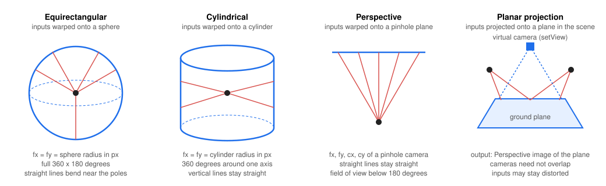
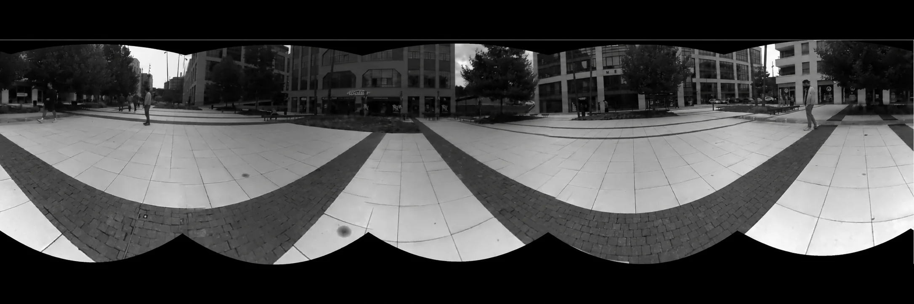
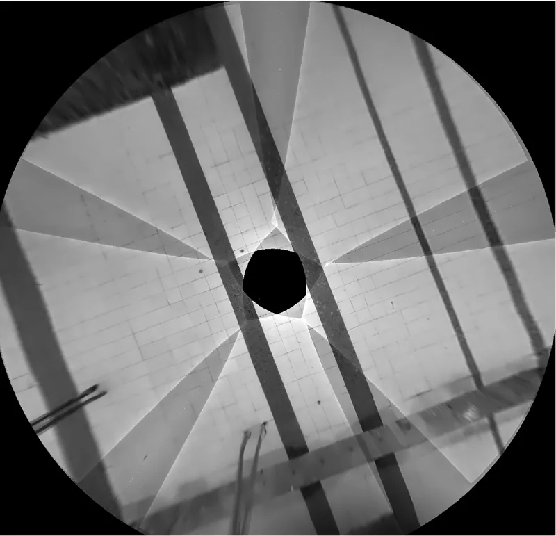

# Host node examples (Python) — DepthAI

Examples of nodes that run on the host instead of the device:

| Example | What it shows |
|---------|---------------|
| `display.py` | A minimal custom `HostNode` that shows frames with OpenCV. |
| `host_camera.py` | A `ThreadedHostNode` that feeds frames from a host webcam into the pipeline. |
| `threaded_host_nodes.py` | Two custom `ThreadedHostNode`s linked together. |
| `stitching_panorama.py` | `dai.node.Stitching` composing a panorama of `CAM_B` and `CAM_C` from their calibration. |
| `stitching_planar_projection.py` | `dai.node.Stitching` projecting `CAM_B` and `CAM_C` onto a plane (bird's-eye view). |

> Press **`q`** in the preview window to quit any example.

---

## Stitching

`dai.node.Stitching` combines N time-synchronized image streams into one image. It runs on the host by default
(DepthAI built with OpenCV support) and can run on an RVC4 device with `setRunOnHost(False)`. Both examples stitch
`CAM_B` and `CAM_C` of one device; pass `--deviceIp <ip>` to pick a device, otherwise the first one found is used.

```bash
python3 stitching_panorama.py [--deviceIp 192.168.1.10]
python3 stitching_planar_projection.py [--deviceIp 192.168.1.10]
```

The node has two modes, `Mode.PANORAMA` and `Mode.PLANAR_PROJECTION`. The figure shows the projection surfaces each
mode can render onto; the black dots are the real cameras.



### Panorama (`stitching_panorama.py`)

The inputs are warped onto a common projection surface and blended into one panorama. By default the warp is computed
from the calibration carried by the input frames (`setUseInputCalibration(True)`): the intrinsics and the rotation of
every camera are read from the frame metadata, so no feature matching is needed and the cameras do not have to
overlap. The inputs must be **undistorted** for this (`requestOutput(..., enableUndistortion=True)`). With
`setUseInputCalibration(False)` the node registers the images from their content instead, which needs overlap and
texture but no calibration.

`setCameraModel()` selects the surface, which is also the `dai.CameraModel` of the output `ImgTransformation`:

| `setCameraModel()` | Surface | When to use it |
|--------------------|---------|----------------|
| `Equirectangular` (default) | sphere | Full horizontal and vertical coverage. Straight lines bend near the top and bottom. |
| `Cylindrical` | cylinder | Cameras rotated around one axis (a ring of cameras). Vertical lines stay straight, the panorama can span the full 360°. |
| `Perspective` | pinhole plane | Two or three cameras with a narrow combined field of view. Straight lines stay straight, the canvas grows quickly with the field of view and cannot reach 180°. |

`Fisheye` and `RadialDivision` are rejected: they are lens distortion models of the pinhole plane, not surfaces to
render onto.

Where inputs overlap, `setSeamFinder()` picks how the seam is found. `SeamFinder.NONE` copies the inputs in order and is
the fastest; any other value (`VORONOI`, `DP_COLOR`, `DP_COLOR_GRAD`, `GRAPHCUT_COLOR` (default), `GRAPHCUT_COLOR_GRAD`)
also enables exposure compensation and multiband blending. `setMaxPanoramaSize()` bounds the canvas.

Five OAK4 devices in a ring on a city square, composed from their calibration:



### Planar projection (`stitching_planar_projection.py`)

The inputs are projected onto a plane given in the coordinate system of the origin camera (`setPlane(point, normal,
unit)`; X right, Y down, Z forward) and rendered from a virtual pinhole camera looking straight at the plane. With the
ground as the plane this is a bird's-eye view. The projection uses the full camera model of the inputs, so they do not
need to be undistorted, and the cameras do not need to overlap.

- `setView()` / `setViewAuto()`: by default the view is computed so that the footprints of all inputs fit, bounded by
  `setMaxViewSize()`; pass a `Stitching.VirtualCamera` to render a fixed region at a fixed resolution.
- `setMaxRange()` and `setMinIncidenceAngle()` cut off the part of the plane near the horizon, where a few pixels would
  be stretched over a large area.

The same five cameras as above, projected onto the pavement of the square. The hole in the middle is the ground
directly under the rig, which no camera sees:



### Output metadata

The stitched `ImgFrame` (type `BGR888i`) carries an `ImgTransformation` describing the virtual camera that rendered
it. For a panorama, `getDistortionModel()` returns the value of `setCameraModel()`, `fx = fy` is the radius of the
sphere or cylinder in pixels and `(cx, cy)` is the pixel the panorama Z axis projects to; there are no distortion
coefficients. For a planar projection it is the pinhole camera of `setView()`. Cameras of several devices can be
stitched on the host when the pipeline carries a cross-device calibration graph (`Pipeline.setMultiDeviceCalibration()`,
beta).
